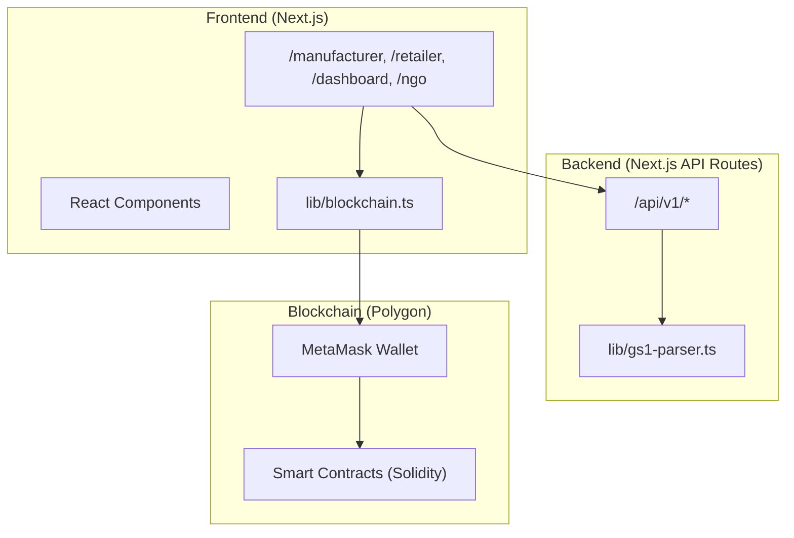
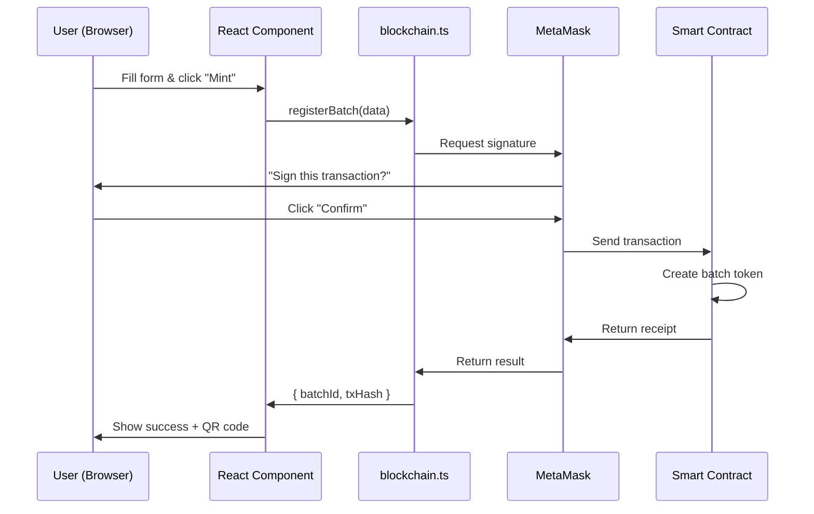
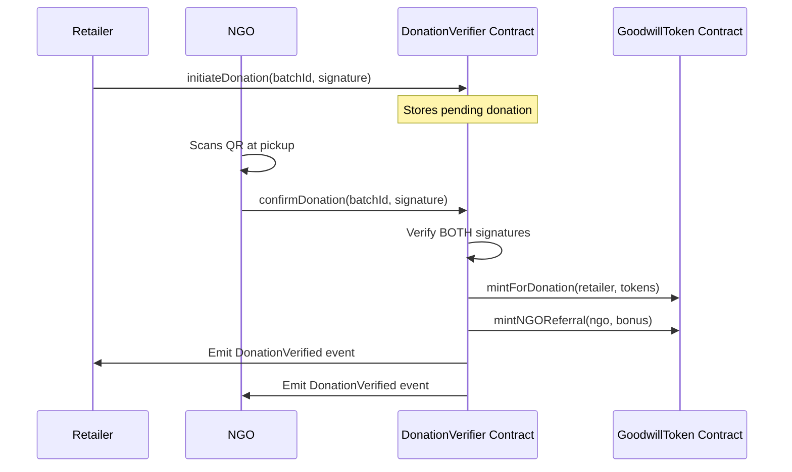

# EcoLink - Circular Supply Chain Platform

## 🎯 Developer Guide (For Non-Blockchain Developers)

> **TL;DR**: This is a Next.js web app with a "database" that lives on blockchain instead of MongoDB/PostgreSQL. You interact with it using a library called `ethers.js` instead of Prisma/Mongoose.

---

## 📖 What is This Project?

A supply chain tracking platform where:
1. **Manufacturers** create product batches (like creating a row in a database)
2. **Retailers** claim and manage inventory (like updating records)
3. **NGOs** verify donations (triggers token rewards)
4. **Parent Company** sees dashboard analytics

**The "blockchain" part just means:**
- Data is stored on a decentralized network (Polygon) instead of AWS/MongoDB
- We use "Smart Contracts" (like stored procedures in SQL) instead of API endpoints
- Users sign transactions with their wallet (like OAuth, but for money)

---

## 🏗️ Architecture Overview



---

## 🗂️ Project Structure

| Folder | Purpose | Blockchain? |
|--------|---------|-------------|
| `app/` | Next.js pages and routes | ❌ No |
| `app/api/` | Backend API endpoints | ❌ No |
| `components/` | React components | ❌ No |
| `lib/gs1-parser.ts` | QR code parsing utility | ❌ No |
| `lib/mock-data.ts` | Demo data for UI | ❌ No |
| `lib/blockchain.ts` | **Blockchain integration** | ✅ YES |
| `contracts/` | Smart contracts (Solidity) | ✅ YES |

---

## 🔗 Understanding Blockchain Integration

### Think of it Like This:

| Traditional Web App | Blockchain Equivalent |
|---------------------|----------------------|
| PostgreSQL Database | Smart Contract on Polygon |
| Prisma/Mongoose ORM | ethers.js library |
| API Key Auth | MetaMask Wallet Signature |
| POST /api/create | `contract.registerBatch()` |
| GET /api/read | `contract.getBatch()` |
| Database Row ID | Batch Token ID |

### The Key File: `lib/blockchain.ts`

This is the **ONLY file** where blockchain happens. It exports functions like:

```typescript
// These work JUST LIKE regular async functions
await registerBatch({ expiry, quantity, gs1Hash, weightKg })  // Like POST
await getBatchDetails(batchId)                                 // Like GET
await claimBatch(batchId)                                      // Like PUT
```

---

## 📱 Page-by-Page Integration Guide

### 1. Landing Page (`app/page.tsx`)
| Feature | Blockchain? | Notes |
|---------|-------------|-------|
| Hero section | ❌ | Just static HTML/CSS |
| Role cards | ❌ | Links to other pages |
| Stats | ⚠️ Optional | Could fetch from blockchain |

**Integration needed:** None (or optionally fetch network stats)

---

### 2. Manufacturer Page (`app/manufacturer/page.tsx`)



| Feature | Blockchain? | Function to Call |
|---------|-------------|------------------|
| Form inputs | ❌ | Regular React state |
| QR Preview | ❌ | Uses `lib/gs1-parser.ts` |
| "Mint Batch" button | ✅ YES | `registerBatch()` |
| Recent mints list | ✅ YES | Fetch from events/indexer |

**Code Change Needed:**
```typescript
// In handleMint function, replace mock code with:
import { registerBatch } from '@/lib/blockchain';

const handleMint = async () => {
  const result = await registerBatch({
    expiryTimestamp: Math.floor(new Date(expiryDate).getTime() / 1000),
    quantity: itemCount,
    gs1Hash: generatedGS1Url,
    weightKg: weight
  });
  
  // result.batchId = the token ID
  // result.txHash = blockchain transaction ID
};
```

---

### 3. Retailer Page (`app/retailer/page.tsx`)

| Feature | Blockchain? | Function to Call |
|---------|-------------|------------------|
| QR Scanner | ❌ | Uses html5-qrcode library |
| Parse GS1 URL | ❌ | `parseGS1DigitalLink()` |
| "Claim Batch" button | ✅ YES | `claimBatch(batchId)` |
| Inventory list | ✅ YES | Fetch user's tokens |
| "Mark for Donation" | ✅ YES | `markForDonation(batchId)` |

**Code Change Needed:**
```typescript
import { claimBatch, markForDonation } from '@/lib/blockchain';

const handleClaim = async () => {
  const txHash = await claimBatch(batchId);
  // Refresh inventory
};

const handleDonate = async (batchId: number) => {
  const txHash = await markForDonation(batchId);
  // Update UI
};
```

---

### 4. Dashboard Page (`app/dashboard/page.tsx`)

| Feature | Blockchain? | Notes |
|---------|-------------|-------|
| Stats cards | ✅ YES | Query contract for totals |
| Leaflet Map | ❌ | Just UI, markers from data |
| Store list | ⚠️ Mixed | Data can come from DB or chain |
| Critical alerts table | ✅ YES | Query near-expiry batches |

**For MVP:** Use mock data first, add blockchain queries later.

---

### 5. NGO Page (`app/ngo/page.tsx`)



| Feature | Blockchain? | Function to Call |
|---------|-------------|------------------|
| Pending donations list | ✅ YES | Query pending events |
| QR Scanner | ❌ | Uses html5-qrcode |
| "Verify Pickup" button | ✅ YES | `confirmDonation()` |
| Token balance | ✅ YES | `getGoodwillBalance()` |

---

## 🧩 Smart Contracts (Already Written)

You don't need to write Solidity. These are already built:

| Contract | File | What It Does |
|----------|------|--------------|
| SupplyChainBatch | `contracts/SupplyChainBatch.sol` | Stores batch data (like a Batch table) |
| GoodwillToken | `contracts/GoodwillToken.sol` | Reward tokens (like points/credits) |
| ESGSoulbound | `contracts/ESGSoulbound.sol` | Non-transferable certificates |
| DonationVerifier | `contracts/DonationVerifier.sol` | Handles the 2-signature flow |
| ExpiryKeeper | `contracts/ExpiryKeeper.sol` | Auto-checks expiry (cron job) |

---

## 🔌 API Reference (`lib/blockchain.ts`)

### Wallet Functions

| Function | Returns | Description |
|----------|---------|-------------|
| `connectWallet()` | `{ address, provider }` | Opens MetaMask popup |
| `switchNetwork()` | `void` | Switches to Polygon network |

### Batch Functions

| Function | Parameters | Returns | Like SQL... |
|----------|------------|---------|-------------|
| `registerBatch()` | `{ expiry, qty, hash, weight }` | `{ txHash, batchId }` | INSERT INTO batches |
| `getBatchDetails()` | `batchId: number` | `{ expiry, qty, owner, status... }` | SELECT * FROM batches WHERE id=? |
| `claimBatch()` | `batchId: number` | `txHash: string` | UPDATE batches SET owner=? |
| `markForDonation()` | `batchId: number` | `txHash: string` | UPDATE batches SET status='donation' |

### Token Functions

| Function | Parameters | Returns | Description |
|----------|------------|---------|-------------|
| `getGoodwillBalance()` | `address: string` | `string` | User's $GOOD token balance |

---

## 🚀 Development Workflow

### Phase 1: UI Only (No Blockchain)
```bash
npm run dev
# Build all pages using mock data
# File: lib/mock-data.ts
```

### Phase 2: Connect Wallet Button
```typescript
// Add to any page:
import { connectWallet } from '@/lib/blockchain';

const [address, setAddress] = useState('');

const handleConnect = async () => {
  const { address } = await connectWallet();
  setAddress(address);
};

// In JSX:
<button onClick={handleConnect}>
  {address ? `${address.slice(0,6)}...` : 'Connect Wallet'}
</button>
```

### Phase 3: Replace Mock Calls with Real Calls
```typescript
// Before (mock):
const handleMint = async () => {
  const fakeBatchId = `BATCH-${Date.now()}`;
  setMintedBatches([...batches, fakeBatchId]);
};

// After (real blockchain):
import { registerBatch } from '@/lib/blockchain';

const handleMint = async () => {
  const { batchId, txHash } = await registerBatch({...});
  setMintedBatches([...batches, { id: batchId, tx: txHash }]);
};
```

---

## ⚠️ Common Gotchas

### 1. "Transaction Failed" Errors
- **Cause:** User doesn't have test tokens (MATIC)
- **Fix:** Get free test tokens from https://faucet.polygon.technology

### 2. "User Rejected Transaction"
- **Cause:** User clicked "Reject" in MetaMask
- **Fix:** This is expected behavior - wrap in try/catch

### 3. "Wrong Network"
- **Cause:** User is on Ethereum instead of Polygon
- **Fix:** Call `switchNetwork()` before any transaction

### 4. Functions "Hang" Forever
- **Cause:** Waiting for transaction confirmation
- **Fix:** Transactions take 2-10 seconds. Show loading spinner.

---

## 🛠️ Environment Variables

```bash
# .env file
NEXT_PUBLIC_CHAIN_ID=80002              # Polygon Amoy testnet
NEXT_PUBLIC_RPC_URL=https://rpc-amoy... # Blockchain endpoint
NEXT_PUBLIC_BATCH_CONTRACT=0x...        # After deployment
NEXT_PUBLIC_GOODWILL_TOKEN=0x...        # After deployment
```

---

## 📦 Key Dependencies

| Package | Purpose | Docs |
|---------|---------|------|
| `ethers` | Blockchain communication | https://docs.ethers.org/v6/ |
| `next` | React framework | https://nextjs.org/docs |
| `leaflet` | Map visualization | https://leafletjs.com/ |
| `html5-qrcode` | QR scanner | https://github.com/mebjas/html5-qrcode |
| `qrcode` | QR generator | https://github.com/soldair/node-qrcode |

---

## 🧪 Testing Without Real Blockchain

Use the mock functions in `lib/mock-data.ts` and API routes in `app/api/`:

```bash
# Test batch minting
curl -X POST http://localhost:3000/api/v1/batch/mint \
  -H "Content-Type: application/json" \
  -d '{"gtin":"09506000134352","expiryDate":"2026-06-01","batchNumber":"A1","weightKg":25,"itemCount":50}'
```

---

## 📞 Need Help?

| Topic | Where to Look |
|-------|---------------|
| React/Next.js | Standard Next.js docs |
| UI Components | `app/globals.css` has all styles |
| Blockchain calls | `lib/blockchain.ts` - copy examples |
| Smart contracts | Already deployed - just call functions |

---

## 🎯 Summary: What You Need to Do

1. ✅ **Build the UI** - Regular React/Next.js (no blockchain knowledge needed)
2. ✅ **Add Connect Wallet button** - Copy from example above
3. ✅ **Replace mock calls** - Import from `lib/blockchain.ts`
4. ✅ **Handle loading states** - Blockchain calls take 2-10 seconds
5. ✅ **Handle errors** - Wrap in try/catch, show user-friendly messages

**That's it!** The blockchain complexity is hidden inside `lib/blockchain.ts`.
