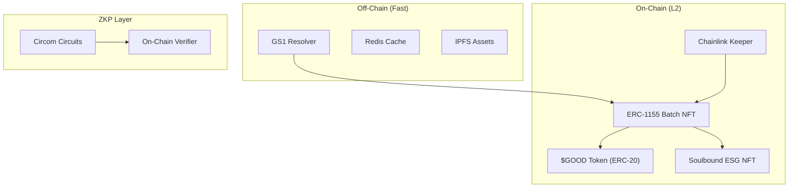

# Layer 2 EVM Optimization - Implementation Plan

Migrating from Solana to **Polygon/Arbitrum** with advanced features for gas optimization, privacy, and ESG compliance.

## Architecture Overview



---

## Proposed Changes

### 1. Smart Contracts (Solidity)

#### [NEW] [contracts/SupplyChainBatch.sol](file:///c:/Users/sumee/OneDrive/Desktop/rtms/contracts/SupplyChainBatch.sol)
ERC-1155 batch token with expiry tracking and status management.

#### [NEW] [contracts/GoodwillToken.sol](file:///c:/Users/sumee/OneDrive/Desktop/rtms/contracts/GoodwillToken.sol)
ERC-20 token with burn-for-tax and staking utility.

#### [NEW] [contracts/ESGSoulbound.sol](file:///c:/Users/sumee/OneDrive/Desktop/rtms/contracts/ESGSoulbound.sol)
Non-transferable Soulbound NFT for sustainability certificates.

#### [NEW] [contracts/ExpiryOracle.sol](file:///c:/Users/sumee/OneDrive/Desktop/rtms/contracts/ExpiryOracle.sol)
Chainlink Automation compatible keeper for expiry monitoring.

---

### 2. Hardhat Configuration

#### [NEW] [hardhat.config.js](file:///c:/Users/sumee/OneDrive/Desktop/rtms/hardhat.config.js)
Multi-network config for Polygon Mumbai (testnet) and Arbitrum Sepolia.

#### [NEW] [scripts/deploy.js](file:///c:/Users/sumee/OneDrive/Desktop/rtms/scripts/deploy.js)
One-command deployment script.

---

### 3. Frontend Updates

#### [MODIFY] [lib/blockchain.ts](file:///c:/Users/sumee/OneDrive/Desktop/rtms/lib/blockchain.ts)
Replace Solana utilities with ethers.js for EVM interaction.

#### [MODIFY] [app/manufacturer/page.tsx](file:///c:/Users/sumee/OneDrive/Desktop/rtms/app/manufacturer/page.tsx)
Update to call ERC-1155 `registerBatch()` function.

#### [MODIFY] [app/ngo/page.tsx](file:///c:/Users/sumee/OneDrive/Desktop/rtms/app/ngo/page.tsx)
Implement double-handshake with multisig verification.

---

### 4. New API Routes

#### [NEW] [app/api/v1/oracle/check-expiry/route.ts](file:///c:/Users/sumee/OneDrive/Desktop/rtms/app/api/v1/oracle/check-expiry/route.ts)
Manual trigger for expiry checks (backup to Chainlink).

#### [NEW] [app/api/v1/zkp/verify/route.ts](file:///c:/Users/sumee/OneDrive/Desktop/rtms/app/api/v1/zkp/verify/route.ts)
ZKP proof verification endpoint.

---

## Key Optimizations

| Before (Solana) | After (L2 EVM) | Benefit |
|-----------------|----------------|---------|
| cNFT per item | ERC-1155 batch | 80% gas savings |
| Manual expiry check | Chainlink Keeper | Automated 24h monitoring |
| Public quantities | ZKP proofs | Competitor privacy |
| Simple tokens | Burn+Stake utility | Economic value |
| Regular NFT | Soulbound NFT | Verifiable ESG reports |

---

## Verification Plan

### Contract Testing
```bash
npx hardhat test
npx hardhat coverage
```

### Testnet Deployment
```bash
npx hardhat run scripts/deploy.js --network polygon_mumbai
```

### Frontend Integration
- Test batch minting on testnet
- Verify double-handshake donation flow
- Confirm $GOOD token minting
