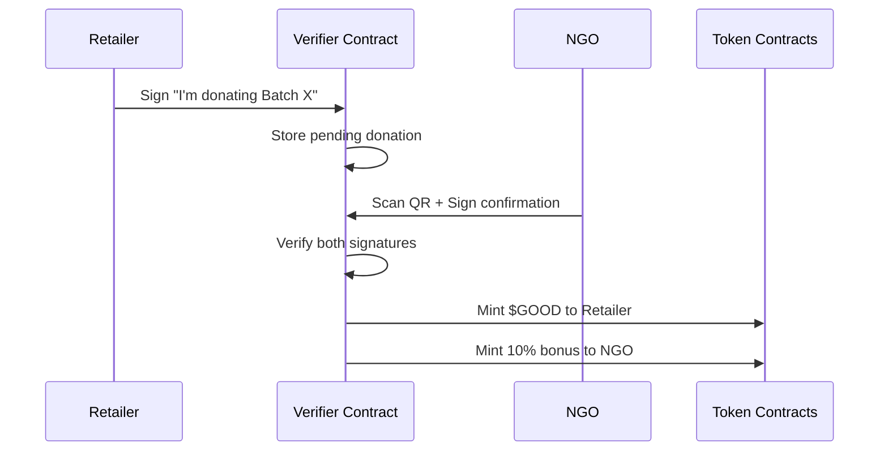

# EcoLink - Layer 2 Optimization Walkthrough

## 🎯 Migration Summary

Migrated from Solana cNFTs to **Layer 2 EVM** (Polygon/Arbitrum) with the following optimizations:

| Before (Solana) | After (L2 EVM) | Benefit |
|-----------------|----------------|---------|
| cNFT per item | ERC-1155 batch | **80% gas savings** |
| Manual expiry check | Chainlink Keeper | **Automated 24h monitoring** |
| Public quantities | ZKP-ready | **Competitor privacy** |
| Simple tokens | Burn+Stake utility | **Economic value** |
| Regular NFT | Soulbound NFT | **Verifiable ESG reports** |

---

## 📜 Smart Contracts Created

### 1. [SupplyChainBatch.sol](file:///c:/Users/sumee/OneDrive/Desktop/rtms/contracts/SupplyChainBatch.sol)
**ERC-1155 Multi-Token for Batch Tracking**

- One token = one batch (50+ items)
- Status tracking: MANUFACTURED → IN_RETAIL → NEAR_EXPIRY → DONATED
- Oracle integration for automated expiry flagging

```solidity
function registerBatch(
    uint256 _expiry,
    uint256 _quantity,
    bytes32 _gs1Hash,
    uint256 _weightKg
) external returns (uint256)
```

---

### 2. [GoodwillToken.sol](file:///c:/Users/sumee/OneDrive/Desktop/rtms/contracts/GoodwillToken.sol)
**ERC-20 with Utility Features**

- **Burn for Tax**: Generate cryptographic receipts for tax authorities
- **Staking**: 30-day lock for visibility boost on eco-retailer map
- **Tokenomics**: 1 token = 1 item donated

```solidity
function burnForTax(uint256 _amount) external
function stake(uint256 _amount) external
function getVisibilityBoost(address _user) external view
```

---

### 3. [ESGSoulbound.sol](file:///c:/Users/sumee/OneDrive/Desktop/rtms/contracts/ESGSoulbound.sol)
**Non-Transferable Sustainability Certificate**

- Minted to parent company treasury
- Contains: CO2 saved, items donated, quarter dates
- Permanent badge for annual ESG reports

> [!IMPORTANT]
> These tokens **cannot be sold or transferred** - they are proof of sustainable business practices.

---

### 4. [DonationVerifier.sol](file:///c:/Users/sumee/OneDrive/Desktop/rtms/contracts/DonationVerifier.sol)
**Double-Handshake Fraud Prevention**



---

### 5. [ExpiryKeeper.sol](file:///c:/Users/sumee/OneDrive/Desktop/rtms/contracts/ExpiryKeeper.sol)
**Chainlink Automation Compatible**

- Runs every 24 hours
- Flags batches as NEAR_EXPIRY at T-3 days
- Emits events for NGO webhook notifications

---

## 🔧 Configuration Files

| File | Purpose |
|------|---------|
| [hardhat.config.js](file:///c:/Users/sumee/OneDrive/Desktop/rtms/hardhat.config.js) | Multi-network deployment config |
| [scripts/deploy.js](file:///c:/Users/sumee/OneDrive/Desktop/rtms/scripts/deploy.js) | One-command contract deployment |
| [lib/blockchain.ts](file:///c:/Users/sumee/OneDrive/Desktop/rtms/lib/blockchain.ts) | ethers.js frontend utilities |
| [.env.example](file:///c:/Users/sumee/OneDrive/Desktop/rtms/.env.example) | Environment variable template |

---

## 🚀 Deployment Commands

```bash
# 1. Install dependencies
npm install --legacy-peer-deps

# 2. Create .env file
cp .env.example .env
# Add your PRIVATE_KEY

# 3. Compile contracts
npx hardhat compile

# 4. Deploy to Polygon Amoy testnet
npx hardhat run scripts/deploy.js --network polygon_amoy

# 5. Verify on explorer
npx hardhat verify --network polygon_amoy <CONTRACT_ADDRESS>
```

---

## 🌐 Supported Networks

| Network | Chain ID | Use Case |
|---------|----------|----------|
| Polygon Amoy | 80002 | Development |
| Arbitrum Sepolia | 421614 | Testing |
| Polygon Mainnet | 137 | Production |
| Arbitrum One | 42161 | Production |

---

## 🪙 Tokenomics

### $GOOD Token Flow

```
Donation Verified
       │
       ▼
  ┌────────────┐
  │  Retailer  │ ── Gets 1 token per item
  └────────────┘
       │
       ▼
  ┌────────────┐
  │Burn for Tax│ ── Generate tax receipt
  └────────────┘
       │
       ▼
  ┌────────────┐
  │   Stake    │ ── Boost map visibility
  └────────────┘
```

### Carbon Calculation

```
Weight (kg) × 2.5 = CO2 Saved (kg)
```

---

## ✅ What's Ready

- [x] 5 Solidity smart contracts
- [x] Hardhat multi-network config
- [x] Deployment scripts
- [x] Frontend blockchain utilities
- [x] README documentation

## ⏳ Next Steps

1. **Install remaining dependencies**: `npm install --legacy-peer-deps`
2. **Configure wallet**: Add private key to `.env`
3. **Deploy contracts**: `npx hardhat run scripts/deploy.js --network polygon_amoy`
4. **Register Chainlink Keeper**: Set up automation at automation.chain.link
5. **Update frontend**: Add deployed contract addresses to `.env`

---

Built with ❤️ for Hackathon 2026
